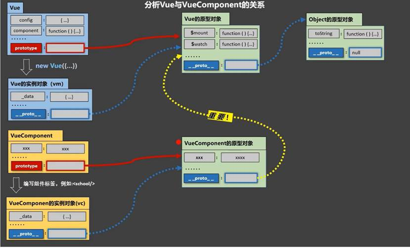
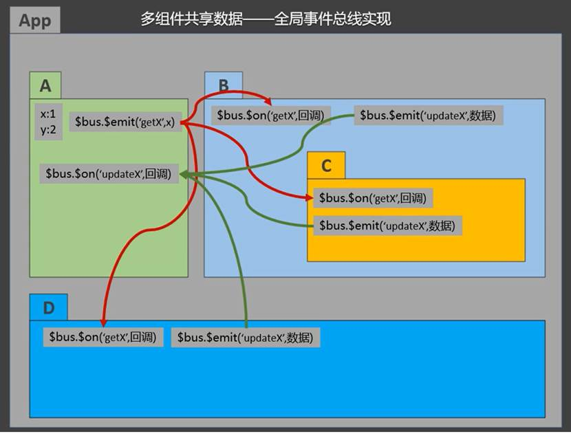
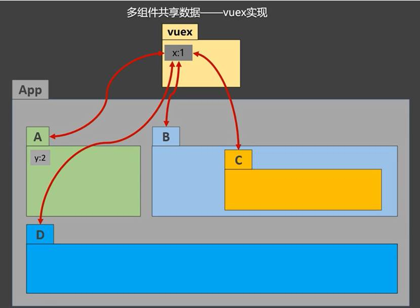
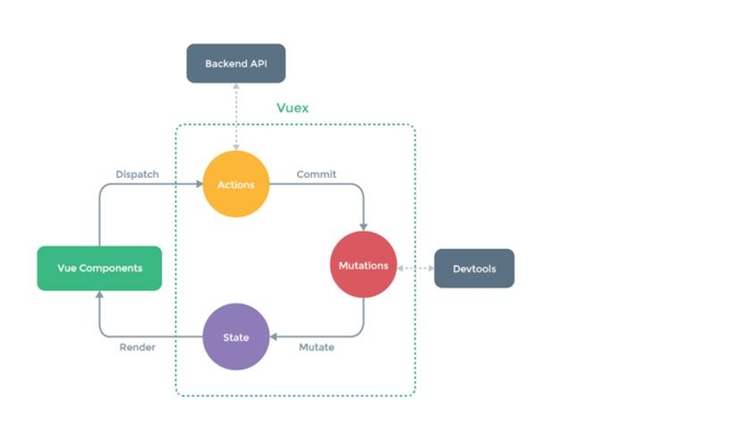

 

### **Vue**模板语法包括两大类

插值语法：

功能：用于解析标签体内容

写法：{{xxx}}，xxx是js表达式，且可以直接读取到data中的所有区域

指令语法：

功能：用于解析标签（包括：标签属性、标签体内容、绑定事件…）

举例：<a v-bind:href="xxx">或简写为<a :href="xxx">，xxx同样要写js表达式，且可以直接读取到data中的所有属性

备注：Vue中有很多的指令，且形式都是v-???，此处我们只是拿v-bind举个例子

 

v:bind绑定 将一个字符串拿出来当表达式来执行

**v-bind:可以简写为:(语法糖形式)**

 

### **Vue**中有2种数据绑定的方式：

单向绑定（v-bind）：数据只能从data流向页面

双向绑定（v-model）：数据不仅能从data流向页面，还可以从页面流向data

备注：

双向绑定一般都应用在表单类元素上（如：<input>、<select>、<textarea>等）

v-model:value可以简写为v-model，因为v-model默认收集的就是value值

 

### **el**有2种写法：

创建Vue实例对象的时候配置el属性

先创建Vue实例，随后再通过vm.$mount('#root')指定el的值

data有2种写法：

对象式

函数式

如何选择：目前哪种写法都可以，以后学到组件时，data必须使用函数，否则会报错

由Vue管理的函数，一定不要写箭头函数，否则this就不再是Vue实例了

 

### **MVVM**模型

M：模型（Model），data中的数据

V：视图（View），模板代码

VM：视图模型（ViewModel），Vue实例

data中所有的属性，最后都出现在了vm身上

vm身上所有的属性 及 Vue原型身上所有的属性，在Vue模板中都可以直接使用

 

### 数据代理

Vue中的数据代理通过vm对象来代理data对象中属性的操作（读/写）

Vue中数据代理的好处：更加方便的操作data中的数据

基本原理：

通过object.defineProperty()把data对象中所有属性添加到vm上。

为每一个添加到vm上的属性，都指定一个getter/setter。

在getter/setter内部去操作（读/写）data中对应的属性。

通过一个对象代理对另一个对象中属性的操作(读写)

 

### 事件处理

v-on绑定点击事件

使用v-on:xxx或@xxx绑定事件，其中xxx是事件名

当绑定点击事件时,一定会返回一个event对象,event.target.innerTest可以获取值

事件的回调需要配置在methods对象中，最终会在vm上

methods中配置的函数，==不要用箭头函数！==否则this就不是vm了

methods中配置的函数，都是被Vue所管理的函数，this的指向是vm或组件实例对象

@click="demo和@click="demo($event)"效果一致，但后者可以传参

 

### **事件修饰符**

Vue中的事件修饰符：

prevent：阻止默认事件（常用）

stop：阻止事件冒泡（常用）

once：事件只触发一次（常用）

capture：使用事件的捕获模式

self：只有event.target是当前操作的元素时才触发事件

passive：事件的默认行为立即执行，无需等待事件回调执行完毕

冒泡:从内到外,捕获：从外向内，一般情况下是先捕获在冒泡

 

### **Vue**中常用的按键别名：

回车：enter

删除：delete (捕获“删除”和“退格”键)

退出：esc

空格：space

换行：tab (特殊，必须配合keydown去使用)

上：up

下：down

左：left

右：right

注意：

系统修饰键（用法特殊）：ctrl、alt、shift、meta

配合keyup使用：按下修饰键的同时，再按下其他键，随后释放其他键，事件才被触发

配合keydown使用：正常触发事件

可以使用keyCode去指定具体的按键，比如：@keydown.13="showInfo"，但不推荐这样使用

Vue.config.keyCodes.自定义键名 = 键码，可以自定义按键别名

 

### Vue一些数组方法

*变异方法*

**push()** 方法可向数组的末尾添加一个或多个元素，并返回新的长度。

**pop()** 方法用于删除并返回数组的最后一个元素。

**shift()** 方法用于把数组的第一个元素从其中删除，并返回第一个元素的值。

**unshift()** 方法可向数组的开头添加一个或更多元素，并返回新的长度。

**splice()** 方法向/从数组中添加/删除项目，然后返回被删除的项目。

**sort()** 方法用于对数组的元素进行排序。

sort(a,b)  { a-b}为升序  {b-a}为降序

**reverse()** 方法用于颠倒数组中元素的顺序。

### 替换数组

**filter()** 方法创建一个新的数组，新数组中的元素是通过检查指定数组中符合条件的所有元素。

**concat()** 方法用于连接两个或多个数组。

**slice()** 方法可从已有的数组中返回选定的元素。

### 其他

**split()** 方法用于把一个字符串分割成字符串数组。

indexof()该方法可以检查一个字符串中含有该内容,则会返回其第一次出现的索引

箭头函数:如果函数只有一条语句,并且该语句只返回一个值,则可以去掉括号和return语句

 

### **计算属性：**

定义：要用的属性不存在，需要通过已有属性计算得来。

原理：底层借助了Objcet.defineproperty()方法提供的getter和setter。

get函数什么时候执行？

初次读取时会执行一次

当依赖的数据发生改变时会被再次调用

优势：与methods实现相比，内部有缓存机制（复用），效率更高，调试方便

备注：

计算属性最终会出现在vm上，直接读取使用即可

如果计算属性要被修改，那必须写set函数去响应修改，且set中要引起计算时依赖的数据发生改变

如果计算属性确定不考虑修改，可以使用计算属性的简写形式

 

### **监视属性watch：**

当被监视的属性变化时，回调函数自动调用，进行相关操作

监视的属性

必须存在，才能进行监视

监视有两种写法：

创建Vue时传入watch配置

通过vm.$watch监视

 

### **深度监视：**

Vue中的watch默认不监测对象内部值的改变（一层）

在watch中配置deep:true可以监测对象内部值的改变（多层）

备注：

Vue自身可以监测对象内部值的改变，但Vue提供的watch默认不可以

使用watch时根据监视数据的具体结构，决定是否采用深度监视

 

### **class**样式：

写法：class="xxx"，xxx可以是字符串、对象、数组

字符串写法适用于：类名不确定，要动态获取

对象写法适用于：要绑定多个样式，个数不确定，名字也不确定

数组写法适用于：要绑定多个样式，个数确定，名字也确定，但不确定用不用

style样式：

:style="{fontSize: xxx}"其中xxx是动态值

:style="[a,b]"其中a、b是样式对象

 

### **v-if**：

写法：

v-if="表达式"

v-else-if="表达式"

v-else

适用于：切换频率较低的场景

特点：不展示的DOM元素直接被移除

注意：v-if可以和v-else-if、v-else一起使用，但要求结构不能被打断

v-show：

写法：v-show="表达式"

适用于：切换频率较高的场景

特点：不展示的DOM元素未被移除，仅仅是使用样式隐藏掉

使用v-if的时，元素可能无法获取到，而使用v-show一定可以获取到

 

### **v-for**指令：

用于展示列表数据

语法：

<li v-for="(item, index) in xxx" :key="yyy">，其中key可以是index，也可以是遍历对象的唯一标识

可遍历：数组、对象、字符串（用的少）、指定次数（用的少）

 

### **面试题：react、vue中的key有什么作用？（key的内部原理）**

虚拟DOM中key的作用：key是虚拟DOM中对象的标识，当数据发生变化时，Vue会根据【新数据】生成【新的虚拟DOM】，随后Vue进行【新虚拟DOM】与【旧虚拟DOM】的差异比较，比较规则如下：

对比规则：

旧虚拟DOM中找到了与新虚拟DOM相同的key：

若虚拟DOM中内容没变, 直接使用之前的真实DOM

若虚拟DOM中内容变了, 则生成新的真实DOM，随后替换掉页面中之前的真实DOM

旧虚拟DOM中未找到与新虚拟DOM相同的key：创建新的真实DOM，随后渲染到到页面

用index作为key可能会引发的问题：

若对数据进行逆序添加、逆序删除等破坏顺序操作：会产生没有必要的真实DOM更新 ==> 界面效果没问题, 但效率低

若结构中还包含输入类的DOM：会产生错误DOM更新 ==> 界面有问题

开发中如何选择key?

最好使用每条数据的唯一标识作为key，比如id、手机号、身份证号、学号等唯一值

如果不存在对数据的逆序添加、逆序删除等破坏顺序的操作，仅用于渲染列表，使用index作为key是没有问题的

 

### **Vue**监视数据的原理：

vue会监视data中所有层次的数据

如何监测对象中的数据？

通过setter实现监视，且要在new Vue时就传入要监测的数据

对象中后追加的属性，Vue默认不做响应式处理

如需给后添加的属性做响应式，请使用如下API：

Vue.set(target,propertyName/index,value)

vm.$set(target,propertyName/index,value)

如何监测数组中的数据？

通过包裹数组更新元素的方法实现，本质就是做了两件事：

调用原生对应的方法对数组进行更新

重新解析模板，进而更新页面

在Vue修改数组中的某个元素一定要用如下方法：

使用这些API：push()、pop()、shift()、unshift()、splice()、sort()、reverse()

Vue.set() 或 vm.$set()

特别注意：Vue.set() 和 vm.$set() 不能给vm 或 vm的根数据对象（data等） 添加属性

 

### **收集表单数据：**

若：<input type="text"/>，则v-model收集的是value值，用户输入的内容就是value值

若：<input type="radio"/>，则v-model收集的是value值，且要给标签配置value属性

若：<input type="checkbox"/>

没有配置value属性，那么收集的是checked属性（勾选 or 未勾选，是布尔值）

配置了value属性：

v-model的初始值是非数组，那么收集的就是checked（勾选 or 未勾选，是布尔值）

v-model的初始值是数组，那么收集的就是value组成的数组

v-model的三个修饰符：

lazy：失去焦点后再收集数据

number：输入字符串转为有效的数字

trim：输入首尾空格过滤

 

### **过滤器：**

定义：对要显示的数据进行特定格式化后再显示（适用于一些简单逻辑的处理）。

语法：

注册过滤器：Vue.filter(name,callback) 或 new Vue{filters:{}}

使用过滤器：{{ xxx | 过滤器名}} 或 v-bind:属性 = "xxx | 过滤器名"

备注：

过滤器可以接收额外参数，多个过滤器也可以串联

并没有改变原本的数据，而是产生新的对应的数据

 

### **之前学过的指令：**

v-bind：单向绑定解析表达式，可简写为:

v-model：双向数据绑定

v-for：遍历数组 / 对象 / 字符串

v-on：绑定事件监听，可简写为@

v-if：条件渲染（动态控制节点是否存存在）

v-else：条件渲染（动态控制节点是否存存在）

v-show：条件渲染 (动态控制节点是否展示)

v-text指令：

作用：向其所在的节点中渲染文本内容

与插值语法的区别：v-text会替换掉节点中的内容，{{xx}}则不会。

 

### **v-html**指令：

作用：向指定节点中渲染包含html结构的内容

与插值语法的区别：

v-html会替换掉节点中所有的内容，{{xx}}则不会

v-html可以识别html结构

严重注意：v-html有安全性问题！！！

在网站上动态渲染任意HTML是非常危险的，容易导致XSS攻击

一定要在可信的内容上使用v-html，永远不要用在用户提交的内容上！！！

 

### **v-clock**指令（没有值）：

本质是一个特殊属性，Vue实例创建完毕并接管容器后，会删掉

v-cloak属性

使用css配合

v-cloak可以解决网速慢时页面展示出

{{xxx}}的问题

 

### **v-once**指令：

v-once

所在节点在初次动态渲染后，就视为静态内容了

以后数据的改变不会引起

v-once所在结构的更新，可以用于优化性能

 

### **v-pre**指令：

跳过其所在节点的编译过程。

可利用它跳过：没有使用指令语法、没有使用插值语法的节点，会加快编译

 

**自定义指令定义语法：**

**局部指令：**

```vue
new Vue({

 directives:{指令名:配置对象}  

 }) 
```


```vue
new Vue({

 directives:{指令名:回调函数}  

 }) 
```


**全局指令：**

Vue.directive(指令名,配置对象)

Vue.directive(指令名,回调函数)

```vue
Vue.directive('fbind',{

//指令与元素成功绑定时（一上来）

bind(element,binding){

element.value = binding.value

},

  //指令所在元素被插入页面时

  inserted(element,binding){

  element.focus()

  },

  //指令所在的模板被重新解析时

  update(element,binding){

  element.value = binding.value

  }

})
```


配置对象中常用的3个回调函数：

bind(element,binding)：指令与元素成功绑定时调用

inserted(element,binding)：指令所在元素被插入页面时调用

update(element,binding)：指令所在模板结构被重新解析时调用

备注：

指令定义时不加“v-”，但使用时要加“v-”

指令名如果是多个单词，要使用

kebab-case命名方式，不要用camelCase命名

 

### opacity:透明度

setInterval() 方法可按照指定的周期（以毫秒计）来调用函数或计算表达式

settimeout() 开启定时器

clearInterval()删除定时器

 

### **生命周期：**

又名：生命周期回调函数、生命周期函数、生命周期钩子

是什么：Vue在关键时刻帮我们调用的一些特殊名称的函数

生命周期函数的名字不可更改，但函数的具体内容是程序员根据需求编写的

生命周期函数中的this指向是vm 或 组件实例对象


 

**常用的生命周期钩子：**

mounted：发送ajax请求、启动定时器、绑定自定义事件、订阅消息等初始化操作

beforeDestroy：清除定时器、解绑自定义事件、取消订阅消息等收尾工作

关于销毁Vue实例：

销毁后借助Vue开发者工具看不到任何信息

销毁后自定义事件会失效，但原生DOM事件依然有效

一般不会在beforeDestroy操作数据，因为即便操作数据，也不会再触发更新流程了

 

###  模块与组件、模块化与组件化：


**模块**

理解：向外提供特定功能的 js 程序，一般就是一个 js 文件

为什么：js 文件很多很复杂

作用：复用 js，简化 js 的编写，提高 js 运行效率

 **组件**

定义：用来实现局部功能的代码和资源的集合（html/css/js/image…）

为什么：一个界面的功能很复杂

作用：复用编码，简化项目编码，提高运行效率

 **模块化**

当应用中的 js 都以模块来编写的，那这个应用就是一个模块化的应用

 **组件化**

当应用中的功能都是多组件的方式来编写的，那这个应用就是一个组件化的应用

 

#### **Vue**中使用组件的三大步骤：

定义组件(创建组件)

注册组件

使用组件(写组件标签)

如何定义一个组件？

使用Vue.extend(options)创建，其中options和new Vue(options)时传入的options几乎一样，但也有点区别：

el不要写，为什么？

最终所有的组件都要经过一个vm的管理，由vm中的el决定服务哪个容器

data必须写成函数，为什么？

避免组件被复用时，数据存在引用关系

如何注册组件？

局部注册：new Vue的时候传入components选项

全局注册：Vue.component('组件名',组件)

编写组件标签：<school></school>

 

**关于组件名：**

一个单词组成：

第一种写法（首字母小写）：school

第二种写法（首字母大写）：School

多个单词组成：

第一种写法（kebab-case命名）：my-school

第二种写法（CamelCase命名）：MySchool （需要Vue脚手架支持）

备注：

组件名尽可能回避HTML中已有的元素名称，例如：h2、H2都不行

可以使用name配置项指定组件在开发者工具中呈现的名字

关于组件标签：

第一种写法：<school></school>

第二种写法：<school/>

备注：不使用脚手架时，<school/>会导致后续组件不能渲染

一个简写方式：const school = Vue.extend(options)可简写为：const school = options

 

### **VueComponent**

关于VueComponent：

school组件本质是一个名为VueComponent的构造函数，且不是程序员定义的，是Vue.extend生成的

我们只需要写<school/>或<school></school>，Vue解析时会帮我们创建school组件的实例对象，即Vue帮我们执行的：new VueComponent(options)

特别注意：每次调用Vue.extend，返回的都是一个全新的VueComponent！

关于this指向：

组件配置中：data函数、methods中的函数、watch中的函数、computed中的函数 它们的this均是VueComponent实例对象

new Vue(options)配置中：data函数、methods中的函数、watch中的函数、computed中的函数 它们的this均是Vue实例对象

VueComponent的实例对象，以后简称vc（也可称之为：组件实例对象）

Vue的实例对象，以后简称vm

只有在本笔记中VueComponent的实例对象才简称为vc

 

#### 一个重要的内置关系



一个重要的内置关系：

VueComponent.prototype.__proto__ === Vue.prototype

为什么要有这个关系：让组件实例对象（vc）可以访问到 Vue 原型上的属性、方法

 

### **js**三种暴露方式：

可以理解为都是暴露出一个对象给其他使用!

**默认暴露: export default{}**

**统一暴露:export{  }**

**分别暴露：export var b =function(){}**

```vue
import * as 名称 from "xxx.js"

//比如

import * as $API from "xxx.js"
```


 

## **什么是Babel**

Babel 是一个 JavaScript 编译器

babel:最新版的javascript编译成当下可以执行的版本

 

### **脚手架文件结构：**

.文件目录

├── node_modules

├── public

│  ├── favicon.ico: 页签图标

│  └── index.html: 主页面

├── src

│  ├── assets: 存放静态资源

│  │  └── logo.png

│  │── component: 存放组件

│  │  └── HelloWorld.vue

│  │── App.vue: 汇总所有组件

│  └── main.js: 入口文件

├── .gitignore: git版本管制忽略的配置

├── babel.config.js: babel的配置文件

├── package.json: 应用包配置文件

├── README.md: 应用描述文件

└── package-lock.json: 包版本控制文件

 

 

 

### **关于不同版本的函数：**

vue.js 与 vue.runtime.xxx.js的区别：

vue.js 是完整版的 Vue，包含：核心功能+模板解析器

vue.runtime.xxx.js 是运行版的 Vue，只包含核心功能，没有模板解析器

因为 vue.runtime.xxx.js 没有模板解析器，所以不能使用 template 配置项，需要使用 render函数接收到的createElement 函数去指定具体内容

 

### **修改默认配置**

vue.config.js 是一个可选的配置文件，如果项目的（和 package.json 同级的）根目录中存在这个文件，那么它会被 @vue/cli-service 自动加载

使用 vue.config.js 可以对脚手架进行个性化定制，详见配置参考 | Vue CLI

 

### ref属性：

被用来给元素或子组件注册引用信息（id的替代者）

应用在html标签上获取的是真实DOM元素，应用在组件标签上获取的是组件实例对象（vc）

使用方式：

打标识：<h1 ref="xxx"></h1> 或 <School ref="xxx"></School>

获取：this.$refs.xxx

 

### **props**配置项：

功能：让组件接收外部传过来的数据(对传过来的数据不能进行修改)

传递数据：<Demo name="xxx"/>

接收数据：

第一种方式（只接收）：props:['name']

第二种方式（限制数据类型）：props:{name:String}

第三种方式（限制类型、限制必要性、指定默认值）：

 

### mixin混入

mixin（混入）：

功能：可以

把多个组件共用的配置提取成一个混入对象

使用方式：

定义混入：

```vue
const mixin = {

  data(){....},

  methods:{....}

  ....

}
```


使用混入：全局混入：Vue.mixin(xxx) 局部混入：mixins:['xxx']

备注：

组件和混入对象含有同名选项时，这些选项将以恰当的方式进行“合并”，在发生冲突时以组件优先

同名生命周期钩子将合并为一个数组，因此都将被调用。另外，混入对象的钩子将在组件自身钩子之前调用

 

### **插件：**

功能：用于增强Vue

本质：包含install方法的一个对象，install的第一个参数是Vue，第二个以后的参数是插件使用者传递的数据

定义插件：

```javascript
plugin.install = function (Vue, options) {

// 1. 添加全局过滤器

Vue.filter(....)

  // 2. 添加全局指令

  Vue.directive(....)

 

  // 3. 配置全局混入

  Vue.mixin(....)

 

  // 4. 添加实例方法

  Vue.prototype.$myMethod = function () {...}

  Vue.prototype.$myProperty = xxxx

}
```


 

使用插件：Vue.use(plugin)

 

### **scoped**样式：

1. 作用：让样式在局部生效，防止冲突

2. 写法：

<style scoped>

scoped样式一般不会在App.vue中使用

 

 

this.todos.filter( 遍历条件)

给todos数组每个对象都会过滤一遍会默认筛选结果为true的元素组成新的数组

this.todos.forEach(遍历条件)对todos数组中的每个对象进行遍历

checked 只有true值和false

vue-for遍历对象

如: 

  <MyItem v-for="todoObj in todos"/>

会形成三个MyItem 且获的三个todoObj

 

### **T**odo-List案例总结

组件化编码流程：

拆分静态组件：组件要按照功能点拆分，命名不要与html元素冲突

实现动态组件：考虑好数据的存放位置，数据是一个组件在用，还是一些组件在用：

一个组件在用：放在组件自身即可

一些组件在用：放在他们共同的父组件上（状态提升）

实现交互：从绑定事件开始

props适用于：

父组件 ==> 子组件 通信

子组件 ==> 父组件 通信（要求父组件先给子组件一个函数）

使用v-model时要切记：v-model绑定的值不能是props传过来的值，因为props是不可以修改的

props传过来的若是对象类型的值，修改对象中的属性时Vue不会报错，但不推荐这样做

 

**WebStorage**

存储内容大小一般支持5MB左右（不同浏览器可能还不一样）

浏览器端通过Window.sessionStorage和Window.localStorage属性来实现本地存储机制

相关API：

xxxStorage.setItem('key', 'value')：该方法接受一个键和值作为参数，会把键值对添加到存储中，如果键名存在，则更新其对应的值

xxxStorage.getItem('key')：该方法接受一个键名作为参数，返回键名对应的值

xxxStorage.removeItem('key')：该方法接受一个键名作为参数，并把该键名从存储中删除

xxxStorage.clear()：该方法会清空存储中的所有数据

备注：

SessionStorage存储的内容会随着浏览器窗口关闭而消失

LocalStorage存储的内容，需要手动清除才会消失

xxxStorage.getItem(xxx)如果 xxx 对应的 value 获取不到，那么getItem()的返回值是null

JSON.parse(null)的结果依然是null

 

**绑定的三种方式**

```vue
<!-- 通过父组件给子组件传递函数类型的props实现子给父传递数据 -->

​    <School :getSchoolName="getSchoolName"/>
```


 

```vue
    <!-- 通过父组件给子组件绑定一个自定义事件实现子给父传递数据（第一种写法，使用@或v-on） -->

​    <!-- <Student @jojo="getStudentName"/> -->
```


 ```vue
 <button @click="sendStudentName">点我传递学生姓名</button>
 
  methods:{
 
 ​      sendStudentName(){
 
 ​        this.$emit('jojo',this.name)
 
 ​      }
 
 ​    }
 ```


```
  <!-- 通过父组件给子组件绑定一个自定义事件实现子给父传递数据（第二种写法，使用ref） -->

<Student ref="student"/>

 mounted(){

​      this.$refs.student.$on('jojo',this.getStudentName)

​    }
```


### 解绑的三种方式：

```vue
 // 解绑一个自定义事件

​        // this.$off('jojo')

​        // 解绑多个自定义事件

​        // this.$off(['jojo'])

​        // 解绑所有自定义事件

​        this.$off()
```


 

### **组件的自定义事件：**

一种组件间通信的方式，适用于：==子组件 > 父组件

使用场景：A是父组件，B是子组件，B想给A传数据，那么就要在A中给B绑定自定义事件（事件的回调在A中）

绑定自定义事件：

第一种方式，在父组件中：<Demo @atguigu="test"/> 或 <Demo v-on:atguigu="test"/>

```vue
//第二种方式，在父组件中：

<Demo ref="demo"/>

...

mounted(){

  this.$refs.demo.$on('atguigu',data)

}
```


若想让自定义事件只能触发一次，可以使用once修饰符，或$once方法

触发自定义事件：this.$emit('atguigu',数据)

解绑自定义事件：this.$off('atguigu')

组件上也可以绑定原生DOM事件，需要使用native修饰符

注意：通过this.$refs.xxx.$on('atguigu',回调)绑定自定义事件时，回调要么配置在methods中，要么用箭头函数，否则this指向会出问题！

 

### **全局事件总线（GlobalEventBus）：**

一种组件间通信的方式，适用于

 任意组件间通信

安装全局事件总线：

```vue
new Vue({

  ...

  beforeCreate() {

  Vue.prototype.$bus = this //安装全局事件总线，$bus就是当前应用的vm

  },

  ...

})  
```


使用事件总线：

接收数据：A组件想接收数据，则在A组件中给

$bus绑定自定义事件，事件的回调留在A组件自身

```vue
export default {

  methods(){

​    demo(data){...}

  }

  ...

  mounted() {

​    this.$bus.$on('xxx',this.demo)

  }

}
```


 

提供数据：

this.$bus.$emit('xxx',data)最好在beforeDestroy钩子中，用$off去解绑当前组件所用到的事件

 

**消息订阅与发布（pubsub）：**

消息订阅与发布是一种组件间通信的方式，适用于任意组件间通信

使用步骤：

安装pubsub：npm i pubsub-js

引入：import pubsub from 'pubsub-js'

接收数据：A组件想接收数据，则在A组件中订阅消息，订阅的回调留在A组件自身

```vue
export default {

  methods(){

​    demo(data){...}

  }

  ...

  mounted() {

this.pid = pubsub.subscribe('xxx',this.demo)

  }

}
```


提供数据：

pubsub.publish('xxx',data)

最好在

beforeDestroy钩子中，使用pubsub.unsubscribe(pid)取消订阅

 

**$nextTick**

$nextTick(回调函数)可以将回调延迟到下次 DOM 更新循环之后执行

 

### **css**中的动画效果

通过 @keyframes 规则，您能够创建动画。

创建动画的原理是，将一套 CSS 样式逐渐变化为另一套样式。

在动画过程中，您能够多次改变这套 CSS 样式。

以百分比来规定改变发生的时间，或者通过关键词 "from" 和 "to"，等价于 0% 和 100%。

0% 是动画的开始时间，100% 动画的结束时间。

animation：表示延迟延迟时间 和延迟方向

transition:过度

transition与animation的区别 1、transition 需要去触发比如：点击事件、鼠标移入事件；而 animation 可以配合 @keyframe 可以不触发事件就触发这个动画

 

集成第三方动画

npm中的animate

 

### **Vue**封装的过度与动画：

作用：在插入、更新或移除 DOM元素时，在合适的时候给元素添加样式类名

写法：

准备好样式：

元素进入的样式：

v-enter：进入的起点

v-enter-active：进入过程中

v-enter-to：进入的终点

元素离开的样式：

v-leave：离开的起点

v-leave-active：离开过程中

v-leave-to：离开的终点

使用<transition>包裹要过度的元素，并配置name属性：

<transition name="hello">

<h1 v-show="isShow">你好啊！</h1>

</transition>

备注：若有多个元素需要过度，则需要使用：<transition-group>，且每个元素都要指定key值

 

vue脚手架配置代理服务器：

方法一：在vue.config.js中添加如下配置：

```vue
devServer:{

  proxy:"http://localhost:5000"

}
```


说明：

优点：配置简单，请求资源时直接发给前端即可

缺点：不能配置多个代理，不能灵活的控制请求是否走代理

工作方式：若按照上述配置代理，当请求了前端不存在的资源时，那么该请求会转发给服务器 （优先匹配前端资源）

方法二：

```vue
devServer: {

  proxy: {

   '/api1': { // 匹配所有以 '/api1'开头的请求路径

​    target: 'http://localhost:5000',// 代理目标的基础路径

​    changeOrigin: true,

​    pathRewrite: {'^/api1': ''}

   },

   '/api2': { // 匹配所有以 '/api2'开头的请求路径

​    target: 'http://localhost:5001',// 代理目标的基础路径

​    changeOrigin: true,

​    pathRewrite: {'^/api2': ''}

   }

  }

}

// changeOrigin设置为true时，服务器收到的请求头中的host为：localhost:5000

// changeOrigin设置为false时，服务器收到的请求头中的host为：localhost:8080
```


说明：

优点：可以配置多个代理，且可以灵活的控制请求是否走代理

缺点：配置略微繁琐，请求资源时必须加前缀

 

### **插槽：**

\1.    作用：让父组件可以向子组件指定位置插入html结构，也是一种组件间通信的方式，适用于==父组件 > 子组件

\2.    分类：默认插槽、具名插槽、作用域插槽

\3.    使用方式：

```vue
父组件中：

​    <Category>

           <div>html结构1</div>

​    </Category>

子组件中：

​    <template>

            <div>

​        <slot>插槽默认内容...</slot>

​      </div>

​    </template>

具名插槽：

父组件中：

​    <Category>

​      <template slot="center">

              <div>html结构1</div>

​      </template>

 

​      <template v-slot:footer>

               <div>html结构2</div>

​      </template>

​    </Category>

子组件中：

​    <template>

            <div>

​        <slot name="center">插槽默认内容...</slot>

​        <slot name="footer">插槽默认内容...</slot>

​      </div>

​    </template>
```


作用域插槽：

理解：

数据在组件的自身，但根据数据生成的结构需要组件的使用者来决定。（games数据在Category组件中，但使用数据所遍历出来的结构由App组件决定）

父组件中：

```vue
<Category>

<template scope="scopeData">

<!-- 生成的是ul列表 -->

<ul>

<li v-for="g in scopeData.games" :key="g">{{g}}</li>

</ul>

</template>

</Category>

 

<Category>

<template slot-scope="scopeData">

<!-- 生成的是h4标题 -->

<h4 v-for="g in scopeData.games" :key="g">{{g}}</h4>

</template>

</Category>

子组件中：

​    <template>

            <div>

​        <slot :games="games"></slot>

​      </div>

​    </template>

 

        <script>

     export default {

      name:'Category',

       props:['title'],

​        //数据在子组件自身

​        data() {

​          return {

​            games:['红色警戒','穿越火线','劲舞团','超级玛丽']

​          }

​        },

​      }

​    </script>

 
```


#### Vuex是什么

概念：专门在 Vue 中实现集中式状态（数据）管理的一个 Vue 插件，对 vue 应用中多个组件的共享状态进行集中式的管理（读/写），也是一种组件间通信的方式，且适用于任意组件间通信





#### 什么时候使用Vuex

多个组件依赖于同一状态

来自不同组件的行为需要变更同一状态

 

####  Vuex工作原理图



 

 

 

Vuex的基本使用：

初始化数据state，配置actions、mutations，操作文件store.js

```vue
//引入Vue核心库

import Vue from 'vue'

//引入Vuex

import Vuex from 'vuex'

//引用Vuex

Vue.use(Vuex)


const actions = {

//响应组件中加的动作

jia(context,value){

// console.log('actions中的jia被调用了',miniStore,value)

context.commit('JIA',value)

},

}


const mutations = {

//执行加

JIA(state,value){

// console.log('mutations中的JIA被调用了',state,value)

state.sum += value

}

}

//初始化数据

const state = {

sum:0

}

//创建并暴露store

export default new Vuex.Store({

actions,

mutations,

state,

})
```


组件中读取vuex中的数据：

$store.state.sum

组件中修改vuex中的数据：

$store.dispatch('action中的方法名',数据) 或 $store.commit('mutations中的方法名',数据)

若没有网络请求或其他业务逻辑，组件中也可以越过actions，即不写dispatch，直接编写commit

 

### **getters**配置项的使用：

概念：当state中的数据需要经过加工后再使用时，可以使用getters加工

在store.js中追加getters配置

```vue
const getters = {

bigSum(state){

return state.sum * 10

}

}

 

//创建并暴露store

export default new Vuex.Store({

...

getters

})

组件中读取数据：$store.getters.bigSum

 
```


 

### mapState与mapGetthers

mapState方法：用于帮助我们映射state中的数据

```vue
computed: {

  //借助mapState生成计算属性：sum、school、subject（对象写法）

   ...mapState({sum:'sum',school:'school',subject:'subject'}),

​    

  //借助mapState生成计算属性：sum、school、subject（数组写法）

  ...mapState(['sum','school','subject']),

},
```


mapGetters方法：用于帮助我们映射getters中的数据

```vue
computed: {

  //借助mapGetters生成计算属性：bigSum（对象写法）

  ...mapGetters({bigSum:'bigSum'}),

 

  //借助mapGetters生成计算属性：bigSum（数组写法）

  ...mapGetters(['bigSum'])

},
```


### mapActions与mapMutations

mapActions方法：用于帮助我们生成与actions对话的方法，即：包含$store.dispatch(xxx)的函数

```vue
methods:{

  //靠mapActions生成：incrementOdd、incrementWait（对象形式） inceementOdd为方法名 函数名

  ...mapActions({incrementOdd:'jiaOdd',incrementWait:'jiaWait'})

 

  //靠mapActions生成：incrementOdd、incrementWait（数组形式）

  ...mapActions(['jiaOdd','jiaWait'])

}
```


mapMutations方法：用于帮助我们生成与mutations对话的方法，即：包含$store.commit(xxx)的函数

```vue
methods:{

  //靠mapActions生成：increment、decrement（对象形式）

  ...mapMutations({increment:'JIA',decrement:'JIAN'}),

  

  //靠mapMutations生成：JIA、JIAN（对象形式）

  ...mapMutations(['JIA','JIAN']),

}
```

mapActions与mapMutations使用时，若需要传递参数，则需要在模板中绑定事件时传递好参数，否则参数是事件对象

 

### **模块化+命名空间**

目的：

让代码更好维护，让多种数据分类更加明确

修改store.js

```vue
const countAbout = {
	namespaced:true,//开启命名空间
	state:{x:1},
    mutations: { ... },
    actions: { ... },
  	getters: {
    	bigSum(state){
       		return state.sum * 10
    	}
  	}
}

const personAbout = {
  	namespaced:true,//开启命名空间
  	state:{ ... },
  	mutations: { ... },
  	actions: { ... }
}

const store = new Vuex.Store({
  	modules: {
    	countAbout,
    	personAbout
  	}
})
```


开启命名空间后，组件中读取state数据：

```vue
//方式一：自己直接读取

this.$store.state.personAbout.list

//方式二：借助mapState读取：

...mapState('countAbout',['sum','school','subject']),
```


开启命名空间后，组件中读取getters数据：

```vue
//方式一：自己直接读取

this.$store.getters['personAbout/firstPersonName']

//方式二：借助mapGetters读取：
...mapGetters('countAbout',['bigSum'])
```

开启命名空间后，组件中调用dispatch

```vue
//方式一：自己直接dispatch

this.$store.dispatch('personAbout/addPersonWang',person)

//方式二：借助mapActions：

...mapActions('countAbout',{incrementOdd:'jiaOdd',incrementWait:'jiaWait'})
```

开启命名空间后，组件中调用commit：

```vue
//方式一：自己直接commit

this.$store.commit('personAbout/ADD_PERSON',person)

//方式二：借助mapMutations：

...mapMutations('countAbout',{increment:'JIA',decrement:'JIAN'}),
```


 

### Vue Router路由管理器

 vue-router的理解

vue 的一个插件库，专门用来实现SPA 应用

 对SPA应用的理解

单页 Web 应用（single page web application，SPA）

整个应用只有一个完整的页面

点击页面中的导航链接不会刷新页面，只会做页面的局部更新

数据需要通过ajax请求获取

 

### **路由的理解**

什么是路由?

一个路由就是一组映射关系（key - value）

key 为路径，value 可能是 function 或 componen

路由分类

后端路由：

理解：value 是 function，用于处理客户端提交的请求

工作过程：服务器接收到一个请求时，根据请求路径找到匹配的函数来处理请求，返回响应数据

前端路由：

理解：value 是 component，用于展示页面内容

工作过程：当浏览器的路径改变时，对应的组件就会显示

 

**路由的基本使用**

安装vue-router，命令：npm i vue-router

应用插件：Vue.use(VueRouter)

编写router配置项：

```vue
//引入VueRouter

import VueRouter from 'vue-router'

//引入Luyou 组件

import About from '../components/About'

import Home from '../components/Home'

 

//创建router实例对象，去管理一组一组的路由规则

const router = new VueRouter({

routes:[

{

path:'/about',

component:About

},

{

path:'/home',

component:Home

}

]

})

 

//暴露router

export default router
```


实现切换（active-class可配置高亮样式）

<router-link active-class="active" to="/about">About</router-link>

​    指定展示位：

<router-view></router-view>

 

### 路由几个注意事项

路由组件通常存放在pages文件夹，一般组件通常存放在components文件夹

通过切换，“隐藏”了的路由组件，默认是被销毁掉的，需要的时候再去挂载

每个组件都有自己的$route属性，里面存储着自己的路由信息

整个应用只有一个router，可以通过组件的$router属性获取到

 

**多级路由**

```vue
配置路由规则，使用children配置项

routes:[

{

path:'/about',

component:About,

},

{

path:'/home',

component:Home,

children:[ //通过children配置子级路由

{

path:'news', //此处一定不要写：/news

component:News

},

{

path:'message', //此处一定不要写：/message

component:Message

}

]

}

]
```


跳转（要写完整路径）：<router-link to="/home/news">News</router-link>

 

命名路由：

作用：可以简化路由的跳转

如何使用：

给路由命名

```vue
{

path:'/demo',

component:Demo,

children:[

{

path:'test',

component:Test,

children:[

{

​          name:'hello' //给路由命名

path:'welcome',

component:Hello,

     }
    ]
  }
 ]
}
```


简化跳转

```vue
<!--简化前，需要写完整的路径 -->

<router-link to="/demo/test/welcome">跳转</router-link>

 

<!--简化后，直接通过名字跳转 -->

<router-link :to="{name:'hello'}">跳转</router-link>

 

<!--简化写法配合传递参数 -->

<router-link 

:to="{

name:'hello',

query:{

  id:666,

​      title:'你好'

}

}"

\>跳转</router-link>
```


 

### **query**参数

传递参数：

<!-- 跳转并携带query参数，to的字符串写法 -->

<router-link :to="/home/message/detail?id=666&title=你好">跳转</router-link>

 

```vue
<!-- 跳转并携带query参数，to的对象写法 -->

<router-link :to="{

path:'/home/message/detail',

query:{

id:666,

​    title:'你好'

}

}">跳转</router-link>
```


接收参数:

```
$route.query.id

$route.query.title
```


### params参数

```vue
配置路由，声明接收params参数：

{

path:'/home',

component:Home,

children:[

{

path:'news',

component:News

},

{

component:Message,

children:[

{

name:'xiangqing',

path:'detail/:id/:title', //使用占位符声明接收params参数

component:Detail

}

]

}

]

}
```


传递参数：

```vue
<!-- 跳转并携带params参数，to的字符串写法 -->

<router-link :to="/home/message/detail/666/你好">跳转</router-link>

 

<!-- 跳转并携带params参数，to的对象写法 -->

<router-link 

:to="{

name:'xiangqing',

params:{

  id:666,

​      title:'你好'

}

}"

\>跳转</router-link>
```


特别注意：路由携带params参数时，若使用to的对象写法，则不能使用path配置项，

必须使用name配置！

接收参数

```
$route.params.id

$route.params.title
```


 

### props配置

作用：让路由组件更方便的收到参数

```vue
{

name:'xiangqing',

path:'detail/:id',

component:Detail,

 

//第一种写法：props值为对象，该对象中所有的key-value的组合最终都会通过props传给Detail组件

// props:{a:900}

 

//第二种写法：props值为布尔值，布尔值为true，则把路由收到的所有params参数通过props传给Detail组件

// props:true

 

//第三种写法：props值为函数，该函数返回的对象中每一组key-value都会通过props传给Detail组件

props(route){

return {

id:route.query.id,

title:route.query.title

}

}

}
```


###  路由跳转的replace方法

作用：控制路由跳转时操作浏览器历史记录的模式

浏览器的历史记录有两种写入方式：push和replace，其中push是追加历史记录，replace是替换当前记录。路由跳转时候默认为push方式

开启replace模式：<router-link replace ...>News</router-link>

 

作用：不借助<router-link>实现路由跳转，让路由跳转更加灵活

具体编码：

```vue
this.$router.push({

name:'xiangqing',

  params:{

​    id:xxx,

​    title:xxx

  }

})

 

this.$router.replace({

name:'xiangqing',

  params:{

​    id:xxx,

​    title:xxx

  }

})

this.$router.forward() //前进

this.$router.back() //后退

this.$router.go() //可前进也可后退

 
```


### 缓存路由组件

作用：让不展示的路由组件保持挂载，不被销毁

具体编码：

```vue
//缓存一个路由组件

<keep-alive include="News"> //include中写想要缓存的组件名，不写表示全部缓存

  <router-view></router-view>

</keep-alive>

 

//缓存多个路由组件

<keep-alive :include="['News','Message']"> 

  <router-view></router-view>

</keep-alive>
```


 

activated和deactivated是路由组件所独有的两个钩子，用于捕获路由组件的激活状态

具体使用：

activated路由组件被激活时触发

deactivated路由组件失活时触发

 

 

**路由守卫**

作用：对路由进行权限控制

分类：全局守卫、独享守卫、组件内守卫

```vue
全局守卫：

//全局前置守卫：初始化时执行、每次路由切换前执行

router.beforeEach((to,from,next)=>{

console.log('beforeEach',to,from)

if(to.meta.isAuth){ //判断当前路由是否需要进行权限控制

if(localStorage.getItem('school') === 'atguigu'){ //权限控制的具体规则
next() //放行
}else{
alert('暂无权限查看')
}
}else{
next() //放行
}
})
//全局后置守卫：初始化时执行、每次路由切换后执行

router.afterEach((to,from) => {

console.log('afterEach',to,from)

if(to.meta.title){ 

document.title = to.meta.title //修改网页的title

}else{

document.title = 'vue_test'

}

})
```

独享守卫：

```vue


beforeEnter(to,from,next){

console.log('beforeEnter',to,from)

  if(localStorage.getItem('school') === 'atguigu'){

​    next()

  }else{

​    alert('暂无权限查看')

  }

}
```


组件内守卫：

```vue
//进入守卫：通过路由规则，进入该组件时被调用

beforeRouteEnter (to, from, next) {...},

//离开守卫：通过路由规则，离开该组件时被调用

beforeRouteLeave (to, from, next) {...},
```


### 路由器的两种工作模式

对于一个url来说，什么是hash值？—— #及其后面的内容就是hash值

hash值不会包含在 HTTP 请求中，即：hash值不会带给服务器

hash模式：

地址中永远带着#号，不美观

若以后将地址通过第三方手机app分享，若app校验严格，则地址会被标记为不合法

兼容性较好

history模式：

地址干净，美观

兼容性和hash模式相比略差

应用部署上线时需要后端人员支持，解决刷新页面服务端404的问题

 